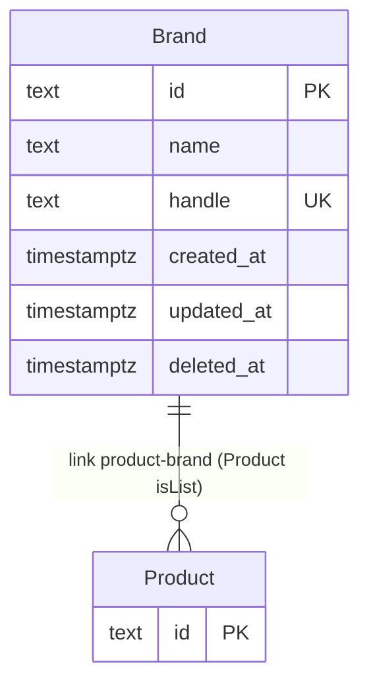

# Backend — Entity-Relationship Model

> Persistence model for `apps/backend`. Derived from custom module sources under `src/modules/`.
> Update when schemas, references, or delete behavior change.

## Overview

- **Store:** PostgreSQL
- **ORM / layer:** Medusa module data models and migrations
- **Custom entities in this package:** `Brand` (product taxonomy; study seed for later vendor-shaped work)

Commerce tables (products, carts, orders, customers, regions, etc.) are owned by Medusa core modules installed via `medusa-config.ts`. This document tracks **chassis-owned** custom models only.

This `Brand` is **not** the white-label client brand in `docs/plan.md` (one clone per client). It is a catalogue label linked to products.

## Entity-relationship diagram

Link definition: `src/links/product-brand.ts` — Product (list) ↔ Brand. No FK into Medusa tables; Medusa owns the link table.

## Entities

### Brand

| Field | Type | Notes |
|-------|------|--------|
| `id` | text PK | Medusa id |
| `name` | text | Searchable |
| `handle` | text unique | Stable public key; created via `toHandle(name)` when omitted |
| `created_at` / `updated_at` / `deleted_at` | timestamptz | Soft-delete on Admin DELETE |

**Delete behavior:** `deleteBrandWorkflow` dismisses product–brand links, then soft-deletes the brand. Compensation restores the brand and recreates links.

**Product link writes:** create product → `productsCreated` hook; update product → `productsUpdated` hook. Pass `additional_data.brand_id` (string to set/change, `null` to clear).

Planned later (`docs/features/`): vendors and vendor users, consignments, commission / payout ledger. Money and rates use `bigNumber`; ledger entries are append-only.

## Notes

- Seed helpers and region config (`src/lib/markets.ts`) are not persistence entities.
- Do not duplicate Medusa core schema in this file; link official commerce module docs instead.
