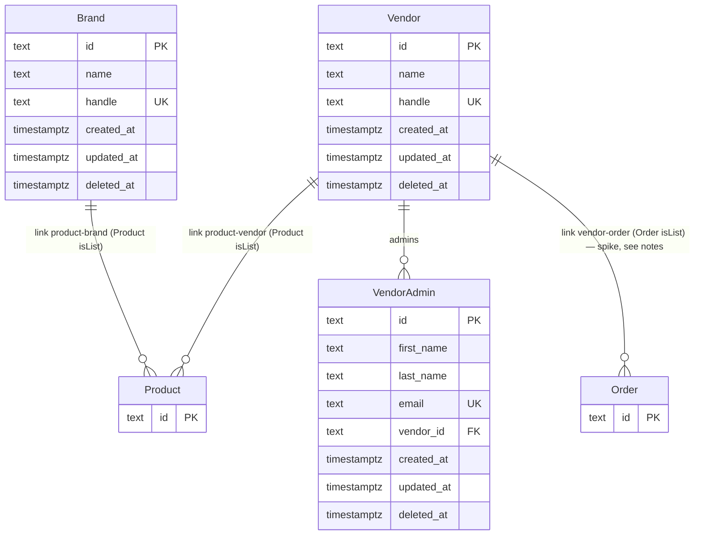

# Backend — Entity-Relationship Model

> Persistence model for `apps/backend`. Derived from custom module sources under `src/modules/`.
> Update when schemas, references, or delete behavior change.

## Overview

- **Store:** PostgreSQL
- **ORM / layer:** Medusa module data models and migrations
- **Custom entities in this package:** `Brand` (product taxonomy; study seed for later vendor-shaped work), `Vendor` / `VendorAdmin` (marketplace actor type — study plan Block C1)

Commerce tables (products, carts, orders, customers, regions, etc.) are owned by Medusa core modules installed via `medusa-config.ts`. This document tracks **chassis-owned** custom models only.

This `Brand` is **not** the white-label client brand in `docs/plan.md` (one clone per client). It is a catalogue label linked to products.

`Vendor` is the marketplace seller from `docs/features/multi-vendor-marketplace.md`; it is a separate concept from `Brand` (taxonomy) even though both currently link to `product`.

## Entity-relationship diagram

Link definitions: `src/links/product-brand.ts` — Product (list) ↔ Brand. `src/links/product-vendor.ts` — Product (list) ↔ Vendor. `src/links/vendor-order.ts` — Order (list) ↔ Vendor, from the `docs/spikes/multi-vendor-order.md` experiment (see that doc — the child-order-per-vendor shape isn't settled yet, so treat this link as provisional). No FK into Medusa tables; Medusa owns the link table.

## Entities

### Brand

| Field                                      | Type        | Notes                                                        |
| ------------------------------------------ | ----------- | ------------------------------------------------------------ |
| `id`                                       | text PK     | Medusa id                                                    |
| `name`                                     | text        | Searchable                                                   |
| `handle`                                   | text unique | Stable public key; created via `toHandle(name)` when omitted |
| `created_at` / `updated_at` / `deleted_at` | timestamptz | Soft-delete on Admin DELETE                                  |

**Delete behavior:** `deleteBrandWorkflow` dismisses product–brand links, then soft-deletes the brand. Compensation restores the brand and recreates links.

**Product link writes:** create product → `productsCreated` hook; update product → `productsUpdated` hook. Pass `additional_data.brand_id` (string to set/change, `null` to clear).

### Vendor / VendorAdmin

`src/modules/vendor` (`VENDOR_MODULE`). `Vendor` is the marketplace seller; `VendorAdmin` is an authenticated staff member of one vendor (custom actor type `vendor`, per `docs/study/README.md` C1).

| Field                                  | Type        | Notes                                                    |
| -------------------------------------- | ----------- | -------------------------------------------------------- |
| `Vendor.id`                            | text PK     | Medusa id                                                |
| `Vendor.name`                          | text        | Searchable                                               |
| `Vendor.handle`                        | text unique | Created via `toHandle(name)` when omitted                |
| `VendorAdmin.id`                       | text PK     | Medusa id                                                |
| `VendorAdmin.first_name` / `last_name` | text        | Nullable                                                 |
| `VendorAdmin.email`                    | text unique | Matches the credentials used at `/auth/vendor/emailpass` |
| `VendorAdmin.vendor` (`vendor_id`)     | belongsTo   | One vendor has many admins                               |

**Auth wiring:** `createVendorWorkflow` (`src/workflows/create-vendor.ts`) creates the `Vendor` and its first `VendorAdmin`, then calls `setAuthAppMetadataStep` with `actorType: "vendor"` so the admin's `AuthIdentity.app_metadata.vendor_id` (actually keyed by `vendor_admin_id` — the actor's own id) lets `authenticate("vendor", ...)` resolve `req.auth_context.actor_id` to that `VendorAdmin`. Every `/vendors/*` route scopes its query from that `actor_id` (e.g. `GET /vendors/products` resolves `vendor_admin.vendor.products`) — never from a value the request supplies.

**Product ownership:** `POST /vendors/products` creates a product via the core `createProductsWorkflow`, always forcing `status: "proposed"` and passing `additional_data.vendor_id` resolved server-side from the caller's `actor_id` — a vendor can never set `vendor_id` itself. The `productsCreated` hook (`src/workflows/hooks/created-product.ts`, shared with Brand — Medusa allows only one handler per hook name) creates the `product-vendor` link when `vendor_id` is present. `POST /vendors/products/:id` and `DELETE /vendors/products/:id` both re-check the product's linked vendor against the caller's before proceeding (`src/api/vendors/products/assert-owned-product.ts`, shared by both routes), 404ing otherwise (not 403 — a vendor can't tell another vendor's product exists); the update schema is `.strict()` so a tampering attempt (e.g. slipping `price` or `vendor_id` into the body) is rejected outright as an unrecognized field, not silently ignored. No approval/publish action exists yet, so a vendor's own products never leave `proposed` on their own — a staff member must flip `status` to `published` by hand (e.g. in Admin) before it's customer-visible; that manual step is the stand-in for the approval workflow that doesn't exist yet. Also still open: vendor onboarding.

**Deleting a vendor's product** is `DELETE /vendors/products/:id` → the same ownership check as update, then the core `deleteProductsWorkflow` called directly — no custom wrapping needed. Verified experimentally (see git history if the reasoning is ever in doubt): `deleteProductsWorkflow` already cleans up **every** module link pointing at a deleted product on its own (soft-deletes the product, and the link row for any `isList` link — vendor, brand, whatever — is removed automatically without a `deleteCascade` on the link and without deleting the *other* side of the link), even across multiple products sharing the same linked entity. An earlier version of this route wrapped the delete in a custom workflow that explicitly dismissed the `product-vendor` link first, on the assumption the link's foreign key would otherwise block deletion — that assumption was wrong, confirmed by testing the raw workflow directly with no dismissal step at all, and the extra workflow was removed as unnecessary complexity. That investigation also surfaced a **real, pre-existing bug** in `src/workflows/hooks/deleted-product.ts` (the Brand feature's own `productsDeleted` hook, since deleted): it called `link.list({[Modules.PRODUCT]: {product_id: ids}, [BRAND_MODULE]: {}})` to find product-brand links, but Medusa's `Link.list` derives the required module key name from `Object.keys(...)` on each side — an empty object produces an empty key name and fails the lookup before any filtering happens ("Module to type product and brand by keys product_id and _ was not found"). Since that hook turned out to be solving a non-problem too (the same automatic link cleanup applies to brand links), it was deleted rather than fixed — every product deletion in the system was silently broken by this hook until removal, not just vendors'.

**Variant/option filtering on the storefront:** the storefront's existing `OptionsPicker` (`apps/storefront/src/modules/store/components/refinement-list/options-picker`) only lists options where `is_exclusive: false` (Medusa's flag for "shared/global option," vs. the default `true` — "exclusive to this one product"). Vendor-created options (`Color`, `Size`, etc.) default to `is_exclusive: true`, so they never appear in that filter. **Do not** flip vendor options to `is_exclusive: false` to fix this — verified experimentally that it breaks product creation outright: a shared option is looked up and created by title with no dedup/reuse in `createProductsWorkflow`'s plain `options` array (only `processProductOptionsForImportStep`, a different step, supports reusing an existing shared option via an explicit `id`), so a second product using the same option title (even the internal "Default" title used for every no-options product) throws `"Product option with title: X, already exists."` Cross-vendor collisions on common titles like "Color" would be even more likely. Making vendor variants filterable needs its own design (e.g. a lookup-or-create-by-title step that resolves to a shared option's `id` before creating each product, with a decision about whether independently-created vendor products *should* share the same underlying option row) — not implemented; tracked as an open item, not a quick field flip.

**Pricing and sales channel at creation:** the vendor sets a price per variant (see "Variants and images" below); the route reads the `store` entity's `default_sales_channel_id` and `supported_currencies` and applies each variant's amount identically across every currency the store supports (no currency conversion — a deliberate simplification, not a pricing feature) and links the product to the store's default sales channel. The route fails loudly (`MedusaError.Types.UNEXPECTED_STATE`) rather than silently creating an unpriced, unpurchasable variant if the store has no supported currencies configured at all. Every vendor product goes out through that one sales channel; a clone that wants per-vendor channels would need to revisit this. `manage_inventory: false` on the variant, same as the Store API's inventory model expects to avoid a stock-location requirement this chassis hasn't built yet.

**Variants and images:** a vendor passes `options: {title, values}[]` (e.g. Size: S/M/L, Color: Red/Blue) and a `variants: []` array with one entry per option combination, each carrying its own `price`, and optionally `sku`, `barcode`, `weight`/`length`/`height`/`width`, `thumbnail`, and `images` — per-variant pricing, not one shared price across every variant. `src/api/vendors/products/build-variants.ts` (`resolveProductVariants`) validates that the submitted variants are exactly the set of combinations the options imply — none missing, none repeated, none extra — and rejects outright above 50 variants, rather than silently accepting a mismatched or oversized set. Images are uploaded separately via `POST /vendors/uploads` (Medusa's `uploadFilesWorkflow`, stored by the Local File provider in dev — `apps/backend/static/`, gitignored); a variant's `images`/`thumbnail` reference those uploaded URLs. That upload route is a deliberately narrow surface: `authenticate("vendor", ...)` already gates it (no anonymous uploads), a fixed allow-list (PNG/JPEG/WEBP/GIF) is checked in the route itself — not left to a client-supplied filename or a multer `fileFilter` that would silently drop a bad file instead of returning a clear error — and multer's own size/count limits (5MB, 5 files) are caught and converted to a normal `MedusaError` 400 rather than leaking through as a bare 500.

Per-variant image association is a second step after `createProductsWorkflow`, not an inline field it accepts — Medusa associates an already-created image to an already-created variant via `productModuleService.addImageToVariant([{image_id, variant_id}])`, matched by variant title and image URL (a variant's own option-value relations aren't reliably populated on the workflow's return value). `POST /vendors/products` runs this through `associateVendorVariantImagesWorkflow` (`src/workflows/associate-vendor-variant-images.ts`) rather than resolving the module service directly in the route — keeping with the "routes stay thin, mutations happen in a workflow step" rule, enforced by `@medusajs/eslint-plugin`'s `no-service-mutations-in-api-route`. That workflow has no compensation: it's a supplementary association, not core commerce data, so if it partially fails the product/variants/prices still exist correctly — only the image-to-variant link would be missing, recoverable with a later update. The route re-queries the product after the workflow runs so its response reflects the associations immediately, since the `createProductsWorkflow` result is a snapshot from before they happened. A variant's `thumbnail` is a plain field, set the same way via `updateProductVariants` inside that same step.

**Order splitting (spike, not settled):** `src/workflows/create-vendor-orders.ts` groups a completed cart's line items by vendor and creates one child order per vendor, linked via `vendor-order`; `POST /store/carts/:id/complete-vendor` replaces the store's own complete-cart call, `GET /vendors/orders` resolves `vendor_admin.vendor.orders`. Verified working for a fresh two-vendor cart, including repeat completion of the same cart (idempotency fixed — see `docs/spikes/multi-vendor-order.md`). Stress-tested: a child order's fulfillment state never rolls up to the parent (status must be computed, not read off the parent); Medusa's native partial fulfillment already lets one child order dispatch in waves without a second order; child orders have no `payment_collections` of their own, only the parent does, so a per-vendor refund needs custom logic. That last point is real evidence leaning toward consignment records over child orders, but the alternative hasn't been built to confirm it. Whether this child-order shape survives is still the open question the spike exists to answer — do not build payouts/returns against this link until that's settled.

Planned later (`docs/features/`): consignments, commission / payout ledger, vendor onboarding/approval. Money and rates use `bigNumber`; ledger entries are append-only.

## Notes

- Seed helpers and region config (`src/lib/markets.ts`) are not persistence entities.
- Do not duplicate Medusa core schema in this file; link official commerce module docs instead.
