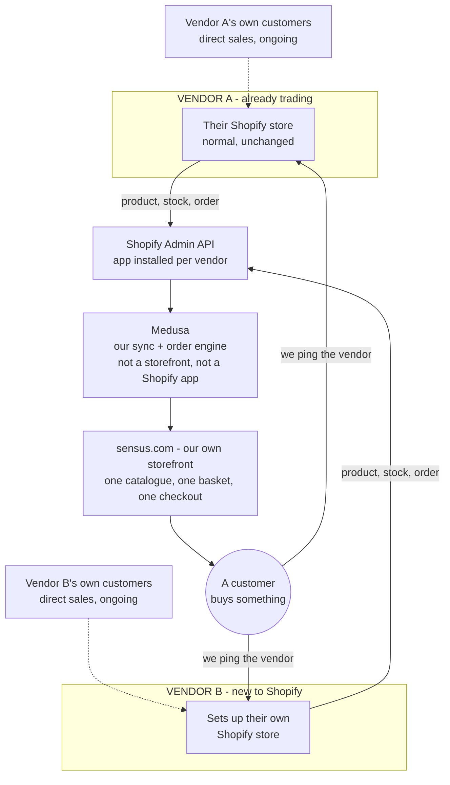

### How we understand the sync (correct us if this is off)

Basically: each vendor keeps their own normal Shopify store — nothing changes for
them. We just read their catalogue and stock in, group everyone's products on our
own site, and ping the vendor when something of theirs sells. Does that match what
you're picturing?

One more thing on this — both vendors above keep selling directly on their own
Shopify too, right? That's the reason this needs to be a live two-way sync, not a
one-off import.

### The doubts we actually have

- **Medusa vs. Shopify Plus itself** — your answer (Q13) says the RFP mandates
  "Shopify Plus core plus a marketplace app." We've been assuming that's about
  each vendor's own store, not our platform. If it actually means our own
  marketplace has to run on Shopify Plus, that's a completely different build —
  let us know which one you meant.
- **Payments** — Shopify Payments (Q8) seems to only work through Shopify's own
  checkout, not as a standalone gateway. Can we just collect the payment ourselves
  and pay vendors out on schedule instead? Same result, way less work for us.
